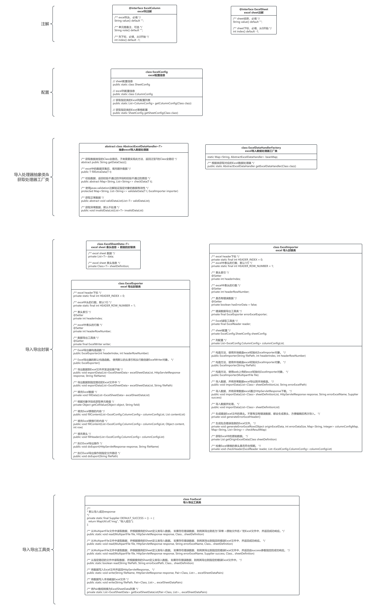
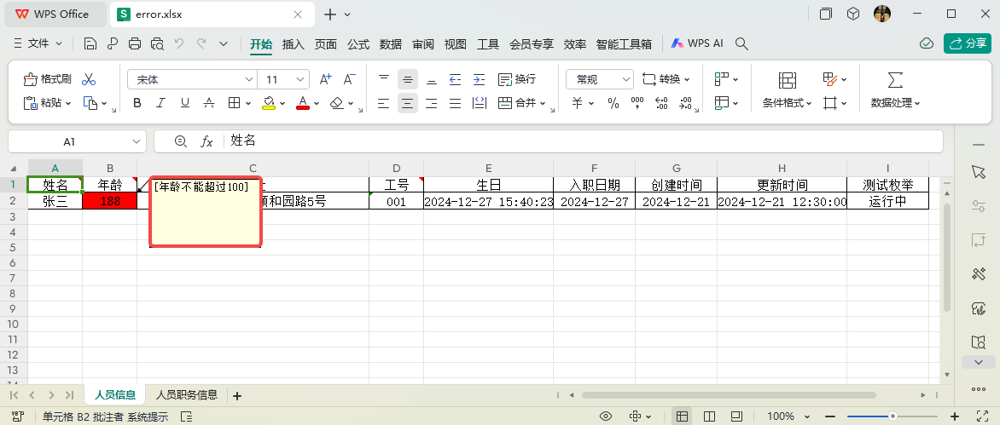

# 简介

fox-excel基于Hutool的excel工具类做了二次封装，可以方便的导入导出多sheet数据。并且导入的时候有异常数据，可以将异常数据和错误信息（作为单元格comment）生成excel导出。

Feature:

- 使用方便，简单的配置后，一行代码即可导入导出
- 自定义采集异常数据，自动导出异常数据excel
- 代码封装可扩展

## UML类图



# 使用

## 第一步：DTO添加注解@ExcelSheet和@ExcelColumn

注意：导入操作，是将excel中的数据转Map再通过Fastjson转成DTO，所以注意复杂属性添加Fastjson的序列化，反序列化器

```java
@Data
@ExcelSheet(value = "人员信息", index = 0)
public class PersonDTO {

    @NotBlank(message = "姓名不能为空")
    @ExcelColumn(value = "姓名", index = 0, note = "姓名备注")
    private String name;
    @Max(value = 100, message = "年龄不能超过100")
    @ExcelColumn(value = "年龄", index = 1, note = "年龄备注")
    private Integer age;
    @ExcelColumn(value = "地址", index = 2)
    private String address;
    @ExcelColumn(value = "工号", index = 3, note = "工号备注")
    private String staffCode;
    /** 1: 内部员工，2：外部员工。模拟非导入数据 */
    private String type;

    @ExcelColumn(value = "生日", index = 4)
    private Date birthday;

    @ExcelColumn(value = "入职日期", index = 5)
    @DateTimeFormat(pattern = "yyyy-MM-dd")
    private Date joinDay;

    @ExcelColumn(value = "创建时间", index = 6)
    private LocalDate createTime;

    @ExcelColumn(value = "更新时间", index = 7)
    private LocalDateTime updateTime;

    @ExcelColumn(value = "测试枚举", index = 8)
    @JSONField(serializeUsing = EnumConverter.class, deserializeUsing = EnumConverter.class)
    private JobLogState jobLogState;
}
```

## 第二步：自定义导入处理器

集成抽象类AbstractExcelDataHandler，并实现其抽象方法即可。

注意：

- getDataClazz()返回DTO的类全路径作为ExcelDataHandlerFactory工厂类的key。
- checkData(T t, ExcelImporter importer)自己实现数据校验，内置了validateData(T t)基于javax.validation注解的校验


```java
@NoArgsConstructor
public class PersonExcelDataHandler extends AbstractExcelDataHandler<PersonDTO> {

    @Override
    public String getDataClazz() {
        return PersonDTO.class.getName();
    }

    @Override
    public PersonDTO fillExtraData(PersonDTO personDTO) {
        personDTO.setType("1");
        return personDTO;
    }

    @Override
    public Map<String, List<String>> checkData(PersonDTO personDTO) {
        return this.validateData(personDTO);
    }

    @Override
    public void validDataList(List<PersonDTO> validDataList) {
        // 数据入库
        System.out.println("数据入库");
        System.out.println(JSON.toJSONString(validDataList, SerializerFeature.PrettyFormat));
    }

    @Override
    public void invalidDataList(List<PersonDTO> invalidDataList) {
        System.out.println("异常数据" + invalidDataList);
        System.out.println(JSON.toJSONString(invalidDataList, SerializerFeature.PrettyFormat));
    }
}
```

## 第三步：接口类使用工具类FoxExcel导入导出

```java
package com.mamba.springcloud.mvc.controller;

import cn.hutool.core.collection.ListUtil;
import cn.hutool.core.lang.Pair;
import com.mamba.springcloud.javabase.hutool.excel.FoxExcel;
import com.mamba.springcloud.javabase.hutool.excel.dto.PersonDTO;
import com.mamba.springcloud.javabase.hutool.excel.dto.PositionDTO;
import com.mamba.springcloud.javabase.jackson.serializer.JobLogState;
import lombok.RequiredArgsConstructor;
import lombok.extern.slf4j.Slf4j;
import org.springframework.web.bind.annotation.PostMapping;
import org.springframework.web.bind.annotation.RequestMapping;
import org.springframework.web.bind.annotation.RestController;
import org.springframework.web.multipart.MultipartFile;

import javax.servlet.http.HttpServletResponse;
import java.time.LocalDate;
import java.time.LocalDateTime;
import java.util.Date;
import java.util.List;

/**
 * @author qiangt
 * @date 2023/8/31
 * @apiNote
 */
@RestController
@RequestMapping("/excel")
@Slf4j
@RequiredArgsConstructor
public class ExcelController {

    @PostMapping("/read")
    public void read(MultipartFile file, HttpServletResponse response) {
        FoxExcel.read(file, response, PersonDTO.class, PositionDTO.class);
    }

    @PostMapping("/write")
    public void write(HttpServletResponse response) {
        FoxExcel.write("测试导出.xlsx", response, Pair.of(PersonDTO.class, getPersonList()),
            Pair.of(PositionDTO.class, getPositionList()));
    }

}

```

导入有异常数据，将异常数据+异常信息导出，方便二次导入


